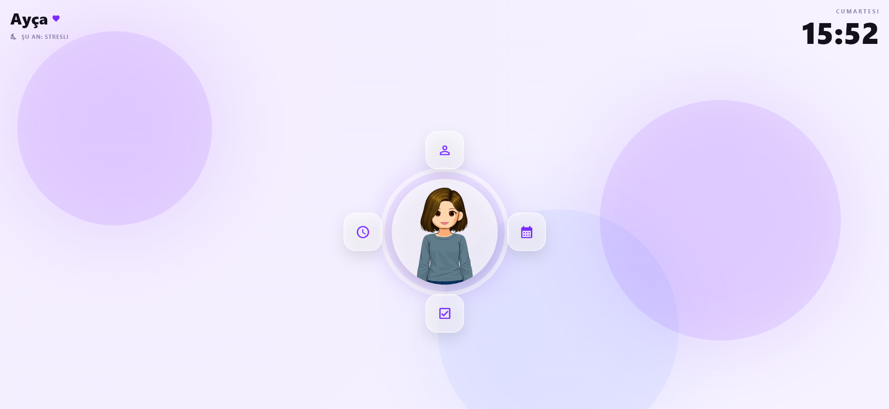
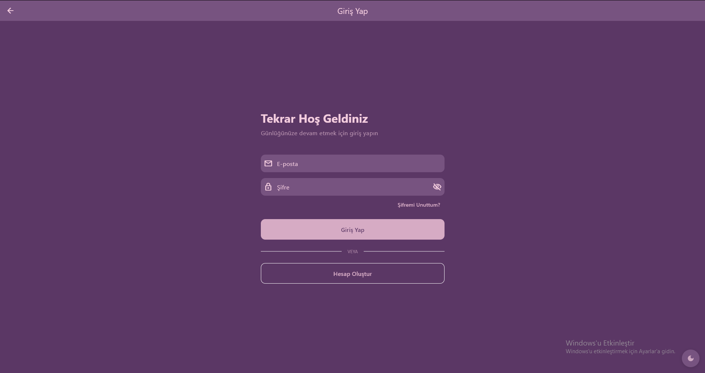
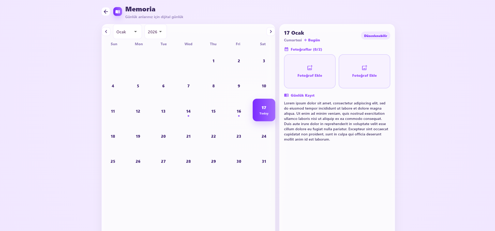
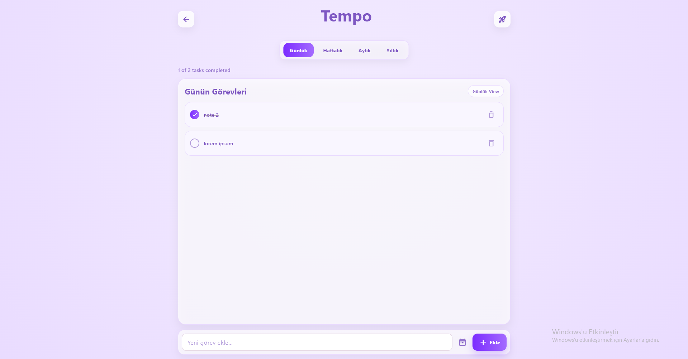
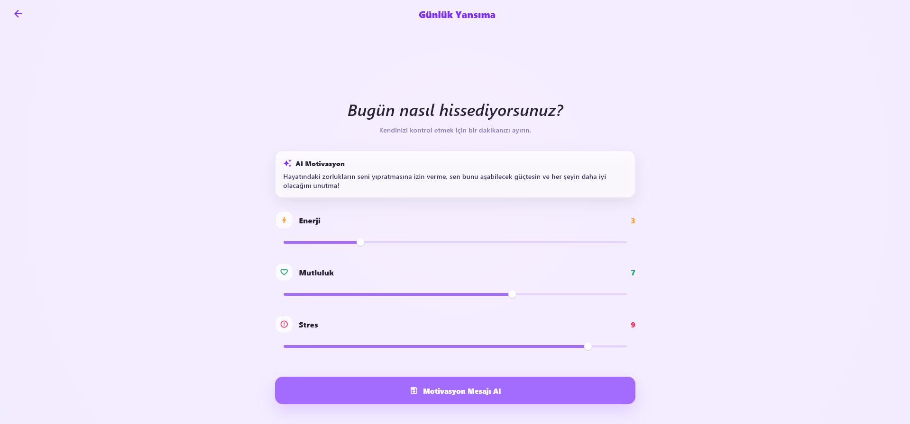
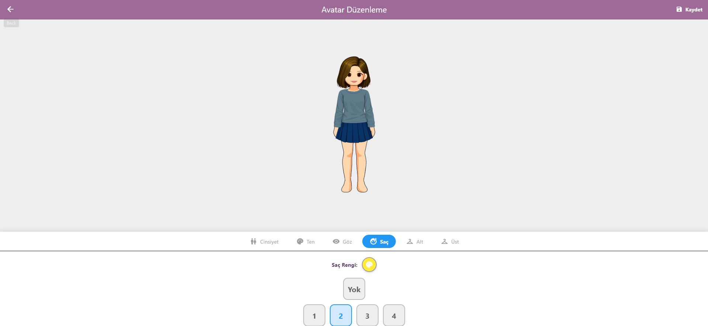
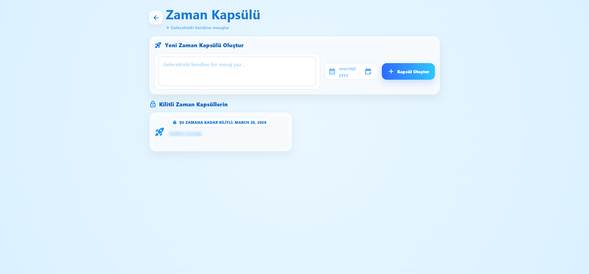

# 🌟 LiP - Life in Pocket

<div align="center">


**Your Personal Life Assistant - Track, Plan, and Thrive** 🚀

[Features](#-features) • [Screenshots](#-screenshots) • [Installation](#-installation) • [Architecture](#-architecture) • [Tech Stack](#-tech-stack)

</div>

---

## 📖 About

**LiP (Life in Pocket)** is a comprehensive daily life management application that combines productivity tracking, mood monitoring, task management, and gamification into one elegant mobile experience. Built with Flutter, LiP helps you organize your day, track your wellness, and maintain a healthy lifestyle through an intuitive and beautiful interface.

### ✨ Key Highlights

- 📅 **Smart Calendar** - Track daily memories with notes and photos
- 🎯 **Focus Hub** - Pomodoro timer with hydration & movement reminders
- ✅ **Task Management** - Organize daily, weekly, monthly, and yearly tasks
- 😊 **Mood Tracking** - Monitor energy, happiness, and stress levels
- 🎮 **Gamification** - Build and customize your personal avatar
- 🌈 **Beautiful UI** - Modern, gradient-rich interface with smooth animations
- 💾 **Hybrid Storage** - Local SQLite + Backend API for optimal performance

---

## 🎯 Features

### 📅 Calendar & Memory Journal
- **Daily Entries**: Record your thoughts and experiences
- **Photo Memories**: Attach up to 2 photos per day (stored locally)
- **Visual Markers**: Quick overview of days with entries
- **Monthly View**: Beautiful calendar interface with dot indicators
- **Date Selection**: Easy navigation through past and future dates

### 🎯 Focus Hub
- **Pomodoro Timer**: Customizable work sessions (5, 10, 15, 25 minutes)
- **Hydration Tracker**: Visual progress for daily water intake (10 cups target)
- **Movement Reminder**: Track your 30-minute exercise blocks (2x daily)
- **Personal Reminders**: Custom task list with completion tracking
- **Clean Interface**: Minimalist design focused on productivity

### ✅ Smart Task Manager
- **Period-Based Tasks**: 
  - Daily tasks
  - Weekly tasks
  - Monthly goals
  - Yearly objectives
- **Due Date Tracking**: Set deadlines for important tasks
- **Completion Status**: Mark tasks as done with visual feedback
- **Task Categories**: Filter and organize by time period

### 😊 Mood & Wellness Tracking
- **Three Dimensions**:
  - ⚡ Energy levels
  - 😊 Happiness meter
  - 😰 Stress indicator
- **Visual Sliders**: Intuitive 1-10 scale for each metric
- **Notes Support**: Add context to your mood entries
- **Historical Data**: Track your emotional journey over time

### 🎮 Avatar System
- **Customizable Character**: Build your unique digital persona
- **Hair Styles**: Multiple hairstyle options
- **Color Choices**: Personalize hair, eyes, and outfit colors
- **Real-time Preview**: See changes instantly
- **Profile Integration**: Your avatar reflects your personality

### 🔐 User Management
- **Secure Authentication**: Email-based login system
- **Profile Management**: Update personal information
- **Settings**: Customize app behavior
- **Data Sync**: Seamless backend integration for notes and tasks

---

## 📱 Screenshots

<div align="center">

### 🏠 Home Screen


*Beautiful gradient interface with easy navigation*

### 🔐 Login & Authentication


*Secure email-based authentication*

### 📅 Calendar & Memory Journal


*Track your daily memories with notes and photos*

### ✅ Task Management


*Organize daily, weekly, monthly, and yearly tasks*

### 😊 Mood Tracking


*Monitor your emotional wellness with energy, happiness, and stress levels*

### 🎮 Avatar Customization


*Personalize your digital character with custom styles and colors*

### ⏰ Time Capsule


*Save messages for your future self*

</div>

---

## 🚀 Installation

### Prerequisites

- Flutter SDK (>=3.4.0)
- Dart SDK (>=3.4.0)
- Android Studio / Xcode (for mobile development)
- Visual Studio 2022 (for Windows development)

### Setup Steps

1. **Clone the repository**
   ```bash
   git clone https://github.com/yourusername/LIP-Life-In-Pocket.git
   cd LIP-Life-In-Pocket
   ```

2. **Install dependencies**
   ```bash
   flutter pub get
   ```

3. **Configure Backend API** (Optional)
   - Update `lib/services/api_service.dart` with your backend URL
   - Default: `http://localhost:3000/api`

4. **Run the app**
   ```bash
   # Android/iOS
   flutter run
   
   # Windows
   flutter run -d windows
   
   # Web
   flutter run -d chrome
   ```

---

## 🏗️ Architecture

### Project Structure

```
lib/
├── main.dart                 # App entry point
├── db/
│   └── app_db.dart          # SQLite database setup
├── models/
│   ├── user.dart            # User data model
│   ├── task.dart            # Task entities
│   ├── mood.dart            # Mood tracking model
│   ├── avatar.dart          # Avatar configuration
│   └── day_entry_model.dart # Calendar entries
├── repositories/
│   ├── user_repository.dart
│   ├── task_repository.dart
│   ├── mood_repository.dart
│   ├── calendar_repository.dart
│   └── focus_repository.dart
├── services/
│   ├── api_service.dart     # Backend communication
│   └── notification_service.dart
├── pages/
│   ├── calendar_page.dart
│   ├── focus_page.dart
│   ├── game_page.dart
│   └── todos_page.dart
├── screens/
│   ├── home_screen.dart
│   ├── login_screen.dart
│   ├── register_screen.dart
│   ├── mood_selector_screen.dart
│   ├── avatar_editor_screen.dart
│   └── profile_screen.dart
├── theme/
│   └── app_theme.dart       # UI styling
└── widgets/
    └── custom_widgets.dart
```

### Data Flow

1. **Local-First Approach**: Photos stored in SQLite for instant access
2. **Hybrid Storage**: Notes and tasks synced with backend API
3. **Repository Pattern**: Clean separation of data access logic
4. **State Management**: StatefulWidget with local state
5. **Async Operations**: Future-based data fetching with error handling

---

## 🛠️ Tech Stack

### Frontend
- **Flutter** - Cross-platform UI framework
- **Dart** - Programming language
- **Material Design** - UI components

### Data Storage
- **SQLite** (`sqflite`) - Local database for offline data
- **Shared Preferences** - Simple key-value storage
- **Backend API** - REST API for user data synchronization

### Key Packages
```yaml
dependencies:
  table_calendar: ^3.1.2      # Calendar widget
  sqflite: ^2.3.3             # Local database
  path_provider: ^2.1.4       # File system access
  http: ^1.2.0                # API requests
  image_picker: ^1.1.2        # Photo selection
  file_picker: ^8.1.2         # File selection
  flutter_colorpicker: ^1.1.0 # Avatar customization
  crypto: ^3.0.5              # Password hashing
  intl: ^0.19.0               # Internationalization
```

---

## 🎨 Design Philosophy

### Color Palette
- **Primary**: Deep Purple (`#7B2CFF`, `#A46BFF`)
- **Backgrounds**: Soft gradients (`#F5EEFF`, `#F0E6FF`)
- **Accents**: Blue for hydration, Green for movement
- **Cards**: Clean white with subtle shadows

### UI Principles
- **Minimalism**: Clean, uncluttered interfaces
- **Gradients**: Smooth color transitions for visual appeal
- **Consistency**: Unified design language across all screens
- **Accessibility**: High contrast, readable fonts
- **Responsiveness**: Adapts to different screen sizes

---

## 🔧 Configuration

### Database Schema

The app uses SQLite with the following tables:

- `users` - User accounts and authentication
- `day_entries` - Calendar notes and photo paths
- `tasks` - Task management across different periods
- `moods` - Emotional state tracking
- `avatars` - User avatar customization
- `capsules` - Time capsule feature (future)

### Backend Integration

Update API endpoints in `lib/services/api_service.dart`:

```dart
static const String baseUrl = 'YOUR_BACKEND_URL/api';
```
---

## 👥 Authors

**LiP Development Team**
- AYCA ŞÜKRAN EKŞİ - HAYAT BİLİCİ

---


<div align="center">

**Made with ❤️ using Flutter**

⭐ Star this repo if you find it helpful!

</div>
